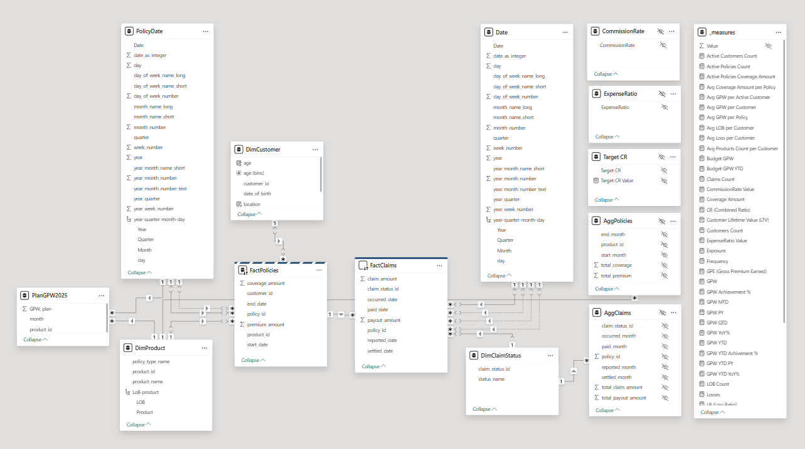

# Insurance Analytics in Power BI

## 📌 Project Overview

This repository contains an end-to-end Insurance Analytics Project built in Power BI, designed to demonstrate professional **data modelling**, **optimisation**, and **dashboarding techniques** commonly used in enterprise BI environments. The project delivers actionable insights across **premiums**, **claims**, **losses**, **customers**, **products**, **lines of business (LOBs)**, and **regional performance**. The solution combines actual insurance data with planning (budget) data to support **Actual vs Plan** analysis.

---

## 🎯 Key Objectives

* Provide a comprehensive view of insurance portfolio performance
* Track core insurance KPIs and profitability metrics
* Demonstrate scalable and production-ready Power BI modelling
* Showcase optimisation, governance, and usability best practices

---

## 📊 Dashboards & Analytics

The Power BI report ([`insurance_dashboards_v2.0.pdf`](insurance_dashboards_v2.0.pdf)) includes the following analytical pages:

* **Premium & Revenue Analytics** – Gross Premium Written (GPW) analysis:
    *  GPW by Line Of Business (LOB), Product, Region
    *  Year-to-Date (YTD), Quarter-to-Date (QTD), and Month-to-Date(MTD) GPW
    *  Actual vs Budget vs Previous Year (PY) GPW, Year-over-Year(YoY) GPW 
* **Claims & Losses Analytics**
    * Claim Frequency, Severity (Average Claim Amount)
    * Reported But Not Settled (RBNS) and Paid Losses
    * Claim Status
* **Profitability** – Financial metrics:
    * Combined Ratio (CR), Loss Ratio (LR)
    * Commission Rate, Expense Ratio
    * Gross Premium Earned (GPE), Losses
* **Customer Insights**
    *  Age distribution
    *  Active customers and Premium in Force by LOB and Product and Region 
    *  Active customers and Premium in Force by Region on the map 
    *  Customer Lifetime Value (CLV/LTV)
    *  Cross-selling metrics: Average Number of LOBs per Customer, Average Number of Products per Customer
* **LOB & Product Performance**
  * GPW, GPE by LOB and Product
  * Claim Frequency, Severity by LOB and Product
  * GPE, Paid Losses, RBNS by LOB and Product
  * CR, LR, Commission Rate, Expense Ration by LOB and Product
  * GPE vs Loss by Product over years (animation)
* **Regional Performance**
   *  GPW by Region, LOB and Product Heatmap
   *  CR  by Region, LOB and Product Heatmap
   *  Top regions by GPW, LTV
   *  Active policies (% of Total) by Region

All dashboards support interactive filtering and drill-downs by **time, region, product, and line of business**.

---

## 🧱 Data Model

* **Source Systems**:

  * PostgreSQL insurance data mart (See: [`insurance-sql-portfolio-project`](https://github.com/AndreyDyachkov/insurance-sql-portfolio-project) )
  * Excel budget / plan table

* **Schema Design**:

  * Star schema
  * Fact tables: Policies, Claims
  * Plan fact table at a different granularity
  * Shared dimensions (Date, Product, Customer, Claim Status)

* **Connectivity**:

  * Import mode for dimension tables and Excel data
  * DirectQuery mode for fact tables

---

## ⚙️ Optimisation Techniques

* Aggregation tables for fact data (`AggPolicies`, `AggClaims`)
* Conversion from snowflake to star schema
* Removal of unnecessary columns
* Custom date tables and disabled auto date/time
* Calculated DAX Date tables for policies and claims

---

## 🧮 DAX & Modelling Features

* Dedicated `_measures` table for all KPIs
* Display folders for logical organisation
* Advanced time intelligence (YTD, PY, YoY)
* Calculated columns: 
  * Customer age
  * Customer geographic location for map visuals
* Hierarchies for smooth drill-down analysis

---

## 🔐 Security & Governance

* Row-Level Security (RLS) by line of business:

  * Health & Travel
  * Motor & Home
* Hidden technical columns to improve report usability

---

## 🔧 Parameters & Production Readiness

* Power Query parameters:

  * `ServerName`
  * `DatabaseName`
* Power BI parameters:

  * `CommissionRate`
  * `ExpenseRatio`

These features enable easy migration between development, test, and production environments.

---

## 🛠 Tech Stack

* **Power BI Desktop** (data modelling, DAX, dashboard design)
* **DAX** (KPIs, calculations, time intelligence)
* **Power Query (M)** (ETL, parameterisation, optimisation)
* **PostgreSQL** (insurance data mart)
* **Excel** (budget / plan data)
* **Import & DirectQuery modes**
* **Star Schema & Aggregation Tables**
* **Row-Level Security (RLS)**

---

## 🚀 How to Use

1. Open [`insurance_dashboards_v2.0.pdf`](insurance_dashboards_v2.0.pdf)
2. For full functionality dowload and open [`insurance_dashboards_v2.0.pbix`](insurance_dashboards_v2.0.pbix)
3. List of DAX measures:  [`_measures.tmdl`](_measures.tmdl)

---
## 📌 Disclaimer

All data used in this project is simulated and created for demonstration and portfolio purposes only.
